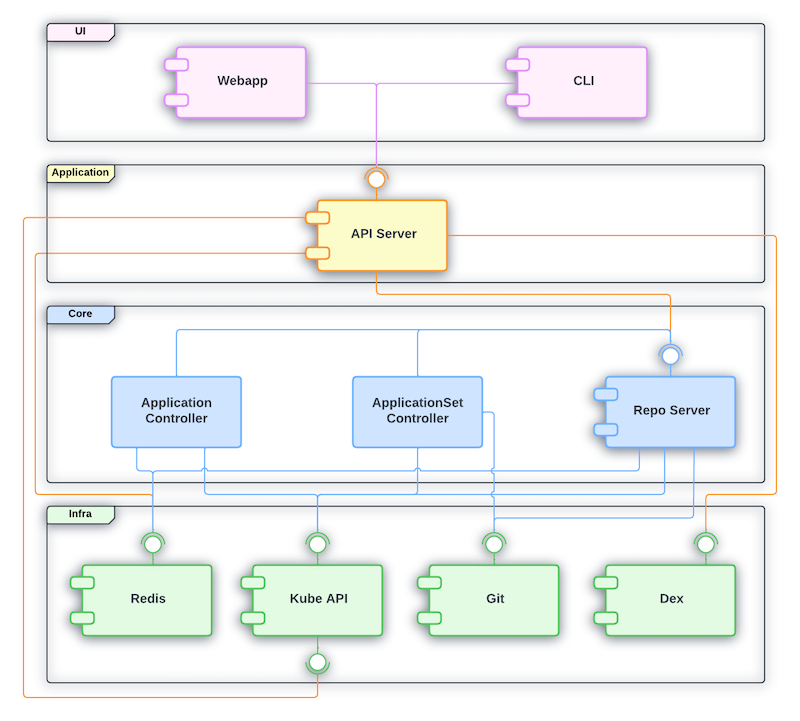

## ArgoCD Components

ArgoCD's core is implemented as **Kubernetes controller**. In addition to the
controller, we deployed a few more things to our clusters:

```terminal:execute
prefix: Run
title: Display all installed parts of ArgoCD
command: |
  clear && kubectl get pods -n argocd
```

We can spot seven deployed workloads:

- **application-controller**: manages and reconciles the `Application` resources;
synchronizes desired application state in Git with the live state in Kubernetes
- **applicationset-controller**: manages and reconciles the `ApplicationSet` resources
- **dex-server**: manages external OIDC auth provider(s)
- **notifications-controller**: manages and reconciles configured notification settings
- **redis**: used for caching of sessions and application/API state
- **repo-server**: manages rendering of applications as defined in Git
- **server**: serves the API to be consumed by CLI and Web UI; hosts the Web UI

Here's a rough visualization from [ArgoCD's developer documentation](https://argo-cd.readthedocs.io/en/stable/developer-guide/architecture/components/)
highlighting the dependencies between the different components:



## ArgoCD CRDs

Kubernetes' API can be extended using so-called `CustomResourceDefinitions` (*CRDs*).
Most often these definitions are leveraged by **controllers** to **codify** certain
processes or routines.

ArgoCD introduces a few CRDs for managing our application state:

```terminal:execute
prefix: Run
title: Display ArgoCD CRDs
command: |
  kubectl api-resources --api-group argoproj.io
```

- `Application`: defines an `Application` to be deployed
  - source
  - destination
  - sync options
- `ApplicationSet`: defines an `ApplicationSet` for deploying applications
  - generator(s)
  - `Application` template
- `AppProject`: defines an `AppProject` containing `Applications`
  - allowed source repositories
  - allowed destination clusters/namespaces
  - allowed resources

There's also a special annotation for `Secrets` which ArgoCD uses to store information
for accessing **repositories**, e.g. **Personal Access Tokens** (*PATs*) or
**SSH Keys**.
