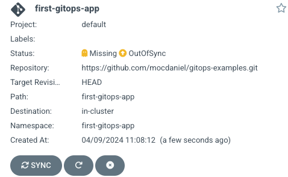

It's time to create our first application!

For starters, we will go with a simple example from [this workshop's GitHub repository](https://github.com/mocdaniel/lab-argocd-odyssey).

## Create an Application

Go ahead and create a new `Application` from the UI with the following settings:

| Setting | Value |
|:--------|:-----:|
| **Application Name** | demo |
| **Project Name** | default |
| **Repository URL** | [https://github.com/mocdaniel/lab-argocd-odyssey.git](https://github.com/mocdaniel/lab-argocd-odyssey.git) |
| **Path** | examples/nginx-demo |
| **Cluster URL** | in-cluster |
| **Namespace** | nginx-demo |

Once we configured our `Application`, we can confirm by clicking **Create** in
the top.

The application will appear in ArgoCD's **Applications view**:

It indicates clearly that it is **out of sync** (obviously, since we never
synced before) and thus resources defined in Git are **missing**.

## Sync an Application

Sync the application by clicking on **Sync**. After a short moment, the UI
will update - **the sync failed!😱**.

## Investigate the Error

1. Navigate to the **Application Details view** by
clicking the Application tile.
2. Click on **Sync failed** to display details of the last sync attempt
3. Find the culprit - we try to deploy to a **non-existing** namespace!

## Sync with Sync Options

This is not a problem though - ArgoCD can create namespaces for us on demand:

1. From the `Application`'s detail page, click on **Sync**
2. Tick the box **Auto-create Namespace**
3. Confirm by clicking on **Synchronize**

After a few seconds, all resources should display a green tick - we successfully
deployed our first `Application` using ArgoCD! 🥳
