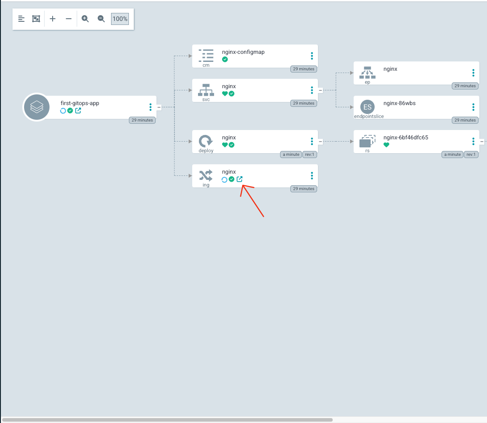
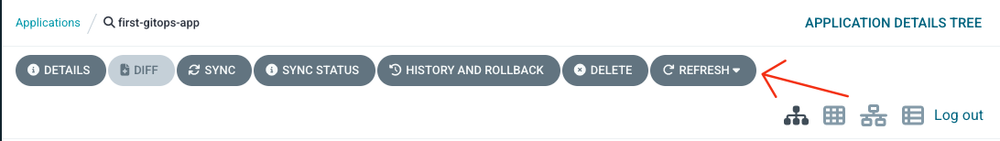
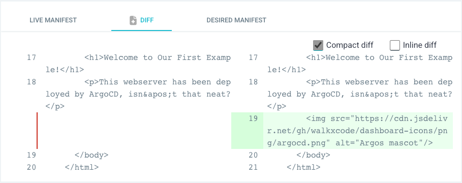

If we click on the quick action on the `Ingress` resource within our Application overview,
it will lead us directly to our deployed version of NGINX.



We are greeted by a friendly welcome message - **it's just missing some color**.

Let's add the Argo mascot to our NGINX deployment, and see how we can go from Kubernetes
manifests to deployed application using Argo once again.

## Updating Our NGINX configuration

If we take another look at the manifests in `first-gitops-app/`, we can see that the landing page
is actually passed statically via a mounted `ConfigMap`.

```editor:open-file
prefix: Editor
title: Open first-gitops-app/configmap.yaml
file: ~/gitops-examples/first-gitops-app/configmap.yaml
```

Here, we can add an `` tag referencing a picture of the Argo mascot on a CDN:

```editor:insert-lines-before-line
prefix: Editor
title: Add  of Argo's mascot to the NGINX configmap
line: 22
text: |2
          
file: ~/gitops-examples/first-gitops-app/configmap.yaml
```

Then we need to **commit and push** our changes again:

```terminal:execute
prefix: Run
title: Commit and push Argo mascot
command: |
  clear
  cd ~/gitops-examples
  git add ./first-gitops-app
  git commit -m "Add Argo mascot"
  git push
```

## Reconciling Our Application

Last thing we need to do is to make ArgoCD **aware of our changes**.

ArgoCD **periodically scans** the referenced repositories and picks up on changes **automatically**,
but we will just hit that **Refresh** button instead to speed things up a bit.



## Diffing and Syncing our Application

Once refreshed, we see the `nginx-configmap` item in the Application's overview getting marked `OutOfSync`.

To confirm our changes, we can view the detected differences by clicking on the item - it conveniently displays our added `` tag as incoming changes.



That's it - we just improved our NGINX deployment to show the Argo mascot!

Empty your browser's cache and reload the NGINX page with `ALT+SHIFT+R` and you should see the Argo mascot greeting you.