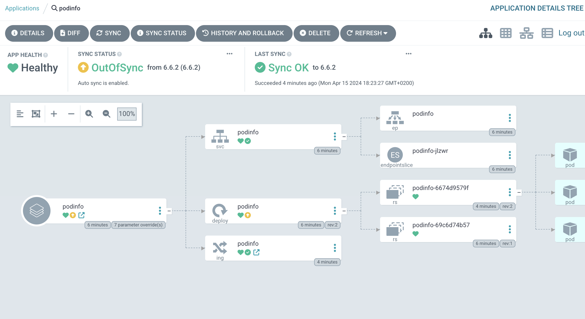
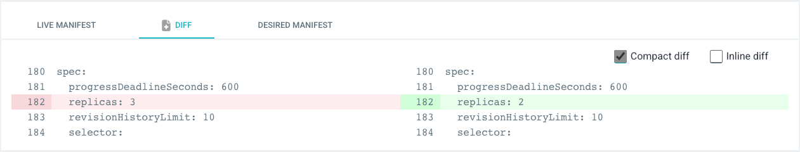
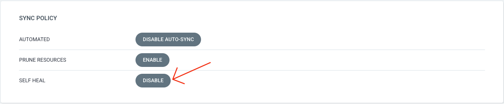

As we just reviewed, up until now we built our Applications either by clicking around in the UI, or chaining CLI commands together - but how does ArgoCD manages Applications internally?

**Just like with Projects, this happens via a dedicated CRD.**

We can have a first look at what this might look like by printing our `podinfo` application to the terminal:

```terminal:execute
prefix: Run
title: Inspect the podinfo Application
command: |
  clear && kubectl get application podinfo -n argocd -o yaml
```

That's a bit much - let's focus on the `spec` part.

```terminal:execute
prefix: Run
title: Inspect the podinfo Application's specs
command: |
  kubectl get application podinfo -n argocd -o yaml | yq .spec
```

**All the settings we configured with the CLI are in here, in a (somewhat) human-readable way.**

Drawing from this conclusion, we should be able to manipulate our Application using `kubectl` itself - let's conduct an experiment.

## Leveraging Application CRDs

Right now, our `podinfo` Application picks up on changes to its managed resources - but doesn't enforce the state. We want to change this by enabling the **auto-healing** capabilities of ArgoCD.

### Making State Drift

First, we will scale up our `podinfo` deployment using kubectl to see how ArgoCD reacts to this:

```terminal:execute
prefix: Run
title: Scale up the podinfo deployment
command: |
  kubectl scale deployment/podinfo \
    --replicas 3 \
    -n podinfo
```

Next, we'll head over to the ArgoCD UI - it should look similar to this:



We can make sure the correct drift was detected by inspecting the `podinfo` Deployment's diff section:



### Patching the Application CRD to Enforce State

ArgoCD by default **doesn't** enforce state - it doesn't even sync automatically, if you think back to our `first-gitops-app`. But we can make it do so, and even enable **autohealing capabilities**, i.e. enforcing desired state as defined in Git.

For this to do, we'll need to set the CRD's field `spec.syncPolicy.automated.selfHeal` to `true`:

```terminal:execute
prefix: Run
title: Patch the Application CRD to automatically heal
command: |
  kubectl patch application podinfo \
  -n argocd \
  --type merge \
  -p '{"spec":{"syncPolicy":{"automated":{"selfHeal":true}}}}'
```

Immediately, we should see ArgoCD syncing our `podinfo` Application and the third replica of the Deployment disappear. Clicking on **Details**, we can see that **SELF HEAL** is now enabled for the Application:



We just learned a very important thing:

**ArgoCD can enforce the state of any Kubernetes resource it is managing.**

This applies to normal, everyday resources like Services, Deployments, and Ingresses, but also to more specialized CRDs, and even **Applications themselves**, which opens up the way for a very interesting concept...