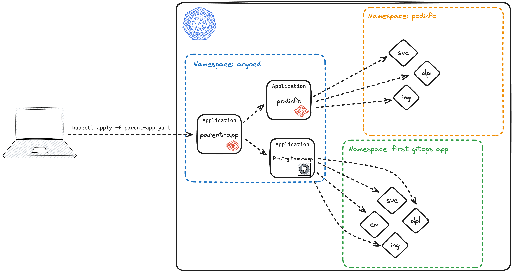

**Applications managing Applications?** Sounds confusing at first, but makes a lot of sense, if you think about the pros:

- single entrypoint into the whole deployment
- automated rollout, reconciliation and enforcement of multiple Applications

Common usecases for App-of-Apps deployments are bootstrapping scenarios: Imagine you need to deploy a whole lot of 'foundational' Applications to a cluster - wouldn't it be nice to only have to deploy a single Application that is in charge of all the others?

For this workshop, we are going to build an **App-of-Apps for our two demo Applications**, `first-gitops-app` and `podinfo`. Let's get going!

## Backing Up Our Application Manifests

First, let's recreate our already existing Applications as CRDs - they would look like this:

```editor:append-lines-to-file
prefix: Editor
title: Create first-gitops-app Application CRD
file: ~/gitops-examples/apps/first-gitops-app.yaml
text: |
  apiVersion: argoproj.io/v1alpha1
  kind: Application
  metadata:
    name: first-gitops-app
    namespace: argocd
  spec:
    destination:
      namespace: first-gitops-app
      name: in-cluster
    project: default
    source:
      path: first-gitops-app
      repoURL: https://github.com/mocdaniel/gitops-examples
      targetRevision: HEAD
    syncPolicy:
      syncOptions:
        - CreateNamespace=true
```


Make sure to change the `repoUrl` entry in the new manifest to **match your fork** of the `gitops-examples` repository!


```editor:append-lines-to-file
prefix: Editor
title: Create podinfo Application CRD
file: ~/gitops-examples/apps/podinfo.yaml
text: |
  apiVersion: argoproj.io/v1alpha1
  kind: Application
  metadata:
    name: podinfo
    namespace: argocd
  spec:
    destination:
      namespace: podinfo
      name: in-cluster
    project: cli-apps
    source:
      chart: podinfo
      helm:
        parameters:
          - name: replicaCount
            value: "2"
          - name: ui.message
            value: Podinfo + ArgoCD = ✨Demo Time✨
          - name: ingress.enabled
            value: "true"
          - name: ingress.className
            value: contour
          - name: ingress.hosts[0].host
            value: podinfo-educates-cli-w03-s001.192.168.1.104.nip.io
          - name: ingress.hosts[0].paths[0].path
            value: "/"
          - name: ingress.hosts[0].paths[0].pathType
            value: "ImplementationSpecific"
      repoURL: ghcr.io/stefanprodan/charts
      targetRevision: 6.6.2
    syncPolicy:
      automated:
        selfHeal: true
      syncOptions:
        - CreateNamespace=true
```
## Deleting Our Applications in ArgoCD

Next, let's delete our existing applications - we don't want any duplicates around! We can do this from the CLI:

```terminal:execute
prefix: Run
title: Delete the podinfo and first-gitops-app Applications
command: |
  argocd app delete podinfo first-gitops-app
```

## Creating Our Umbrella-App

Now to the interesting part - the Application to manage our two other Applications. There's already a manifest `parent-app.yaml` in the root directory of our `gitops-examples` repositories to work with:

```editor:open-file
prefix: Editor
title: Open gitops-examples/parent-app.yaml
file: ~/gitops-examples/parent-app.yaml
```


We've seen a few Application manifests by now - for exercise, try to define the `parent-app` manifest on your own.

The overview below can help with figuring out how we want to deploy things. You can also look at the manifests of the two other applications we just backed up.




## Pushing and Deploying

Once we are happy with out `parent-app`, we still need to push our `apps/` contents to git - otherwise the parent-app won't be able to find them.

```terminal:execute
prefix: Run
title: Push new Application manifests to git
command: |
  clear && cd ~/gitops-examples
  git add .
  git commit -m "Adds app-of-apps example"
  git push -u origin main
```

Once this is done, we can deploy our `parent-app`, either with `argocd` or `kubectl` - pick one 😉

```terminal:execute
prefix: Run
title: Deploy the parent-app Application with kubectl
command: |
  kubectl apply -f ~/gitops-examples/parent-app.yaml
```

```terminal:execute
prefix: Run
title: Deploy the parent-app Application with argocd
command: |
  argocd app create --file ~/gitops-examples/parent-app.yaml
```

**Let's switch to the UI and see the magic happen!**